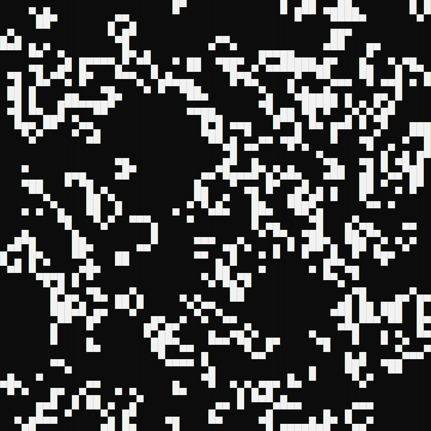

# JeuDeLaVie

## Description

Ce projet vise à créer une version du jeu de la vie de Conway en C++ en utilisant la librairie [consoleGameEngine](https://www.youtube.com/watch?v=cWc0hgYwZyc) de Javidx9.

